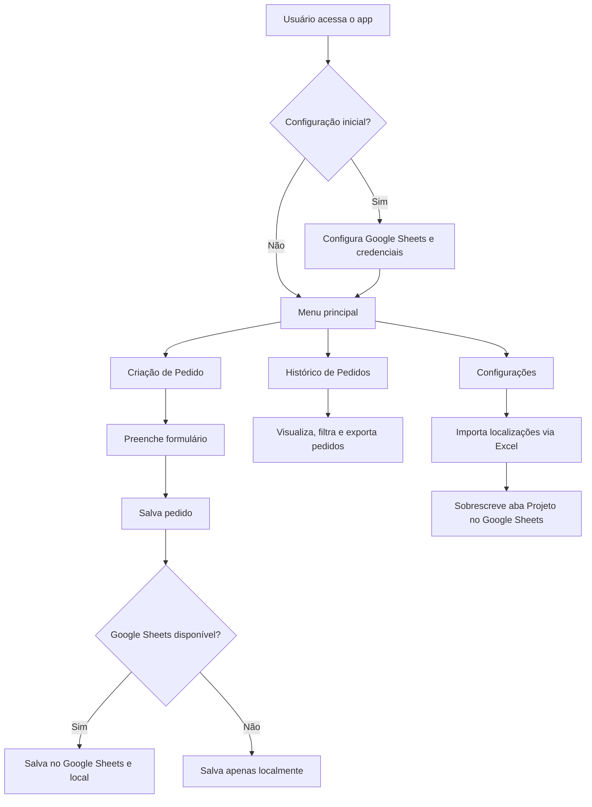
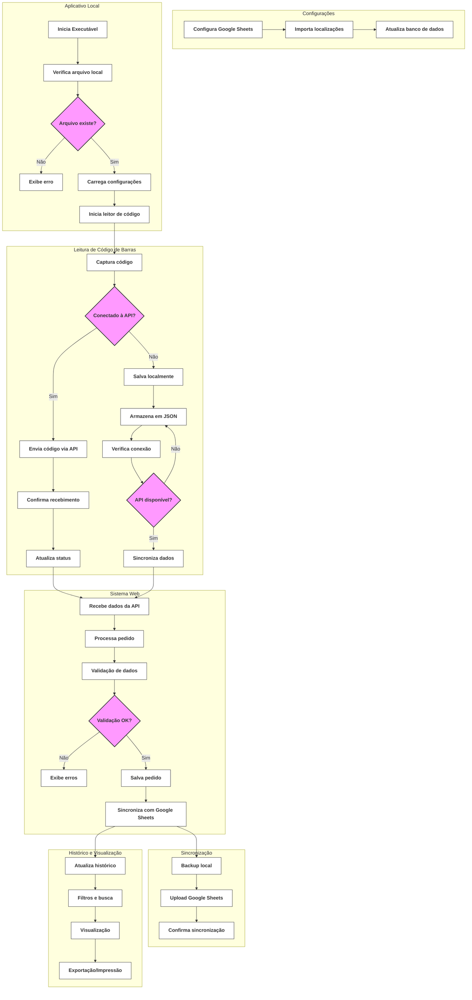

# Sistema de Gestão de Pedidos de Bobina

Sistema desenvolvido em Python com Streamlit para gerenciamento de pedidos de requisição, integrado ao Google Sheets e com suporte a importação/exportação via Excel.

---

## Requisitos

- Python 3.10+ (recomendado)
- Conta Google com permissão de edição na planilha
- Credenciais de serviço do Google (JSON)
- [Streamlit](https://streamlit.io/)
- [gspread](https://gspread.readthedocs.io/)
- Outras dependências listadas em `requirements.txt`

---

## Instalação

1. **Clone este repositório**
   ```bash
   git clone https://github.com/SEU_USUARIO/pedido.git
   cd pedido
   ```

2. **Crie e ative o ambiente virtual**
   ```bash
   python -m venv .venv
   # Windows
   .venv\Scripts\activate
   # Linux/Mac
   source .venv/bin/activate
   ```

3. **Instale as dependências**
   ```bash
   pip install -r requirements.txt
   ```

4. **Configure as credenciais do Google Sheets**
   - Crie um arquivo `secrets.toml` em `.streamlit/` com:
     ```
     [general]
     sheets_url = "URL_DA_SUA_PLANILHA"
     sheets_credentials = 'CONTEUDO_JSON_DAS_CREDENCIAIS'
     ```
   - Compartilhe a planilha com o e-mail do campo `client_email` das credenciais.

---

## Uso

1. Ative o ambiente virtual (se ainda não estiver ativo)
2. Execute o aplicativo:
   ```bash
   streamlit run app.py
   ```
3. O app abrirá no navegador. Acesse a aba de configurações para conectar ao Google Sheets e importar localizações.

---

## Funcionalidades

- Criação e edição de pedidos de bobina
- Visualização e filtro de pedidos por cliente, status, data, etc.
- Atualização de status dos pedidos
- Integração total com Google Sheets (leitura e escrita)
- Importação de localizações via arquivo Excel (aba "Projeto")
- Backup automático dos dados locais
- Interface amigável e responsiva

---

## Estrutura do Projeto

```
.
├── app.py                  # Arquivo principal do Streamlit
├── requirements.txt        # Dependências do projeto
├── config.json             # Configurações locais
├── .streamlit/
│   └── secrets.toml        # Credenciais e URL do Google Sheets
├── models/
│   └── pedido.py           # Modelo de dados do pedido
├── views/
│   ├── configuracoes_view.py
│   ├── pedido_form_view.py
│   ├── pedido_view.py
│   └── pedido_historico_view.py
├── controllers/
│   └── pedido_controller.py
├── utils/
│   ├── sheets_pedidos_sync.py
│   └── sheets_sync.py
└── pedidos/
    └── (backups, arquivos locais, etc.)
```

---

## Fluxo do Sistema (Mermaid)

### Diagrama de Fluxo Principal


### Diagrama de Fluxo Detalhado


---

## Fluxo Detalhado de Operação

### 1. Configuração Inicial
- Acesse a aba "Configurações"
- Configure as credenciais do Google Sheets
- Importe o arquivo Excel com as localizações (aba "Projeto")

### 2. Criação de Pedidos
1. Acesse a aba "Novo Pedido"
2. Selecione o cliente
3. Escolha o RACK
4. Selecione a localização
5. Preencha os dados do pedido
6. Salve o pedido (será sincronizado com Google Sheets se disponível)

### 3. Histórico de Pedidos
1. Acesse a aba "Histórico"
2. Use os filtros para encontrar pedidos específicos
3. Visualize detalhes do pedido
4. Exporte dados se necessário
5. Imprima pedidos selecionados

### 4. Sincronização
- Os dados são sincronizados automaticamente com o Google Sheets
- Backup local é mantido em caso de problemas de conexão
- Importação de localizações pode ser feita a qualquer momento

---

## Dicas e Observações

- **Importação de localizações:** Use a aba de configurações para importar um arquivo Excel com a aba "Projeto". Isso sobrescreve as localizações no Google Sheets.
- **Backup:** O sistema faz backup automático dos dados locais antes de qualquer alteração.
- **Limite de arquivos grandes:** Não faça commit de arquivos Excel grandes no repositório. Use `.gitignore` para evitar problemas.
- **Problemas de autenticação:** Certifique-se de que as credenciais do Google estão corretas e que a planilha está compartilhada com o e-mail do serviço.

---

## Licença

MIT
# Ficha-eletronica
